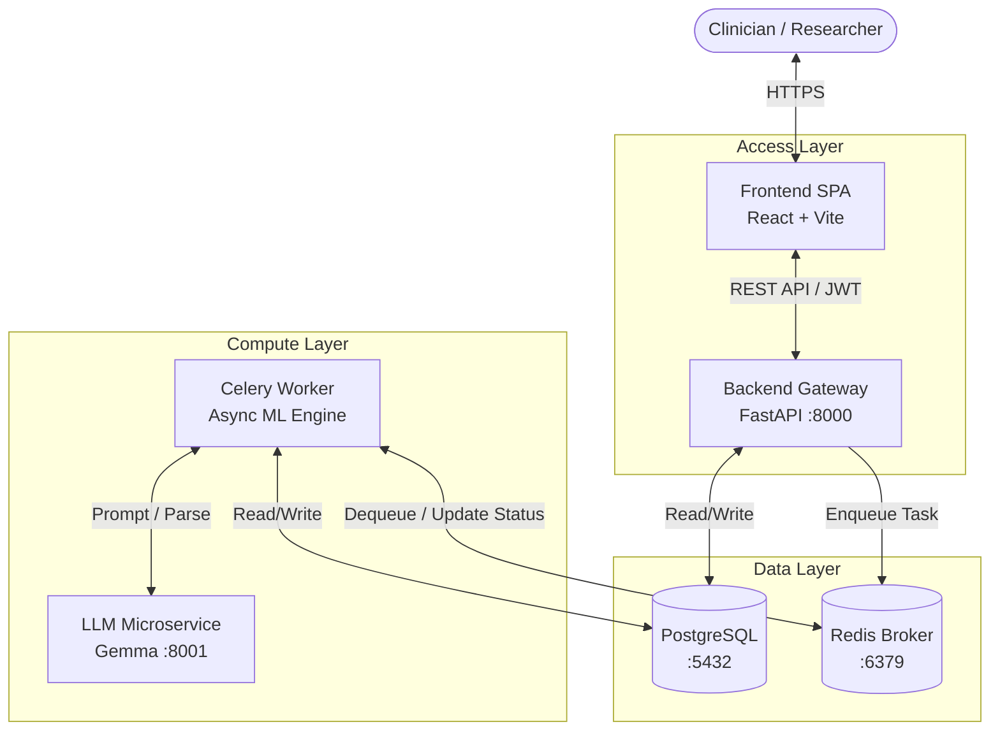

# Hybrid Quantum Machine Learning Platform for Early Disease Detection

This directory contains the production-ready implementation of the Hybrid Quantum Machine Learning Platform for Early Disease Detection. The platform is designed to provide clinicians and researchers with an end-to-end workflow for analyzing medical datasets, preprocessing data intelligently via an AI agent, training classical and quantum machine learning models, and comparing their performance.

## 🏗️ Architecture

The platform follows a modern, scalable, microservices-based architecture orchestrated via Docker Compose:

1.  **Frontend Web Application (React + Vite + TypeScript):** Provides a rich, interactive clinical and administrative dashboard. Built with Tailwind CSS and Radix UI components.
2.  **Backend API Gateway (FastAPI):** Serves as the central entry point for the frontend, handling authentication, routing, and synchronous database operations.
3.  **Asynchronous Task Worker (Celery):** Handles long-running, compute-intensive tasks such as AI preprocessing, feature selection, and model training (both classical and quantum) without blocking the API.
4.  **Local LLM Microservice (FastAPI + Gemma):** A dedicated, sandboxed microservice running a quantized Gemma model to power the AI Preprocessing Agent.
5.  **Relational Database (PostgreSQL):** Stores users, clinical datasets metadata, preprocessing runs, trained model registries, and evaluation metrics.
6.  **Message Broker / Cache (Redis):** Manages the Celery task queue and caches transient data.

## 🔄 Information Flow



## 💻 Tech Stack

*   **Frontend:** React 18, TypeScript, Vite, Tailwind CSS, Lucide React, Axios, React Router v6, Recharts.
*   **Backend:** Python 3.10+, FastAPI, SQLAlchemy, Pydantic, Celery.
*   **Machine Learning / Quantum:** Scikit-Learn, PennyLane, PyTorch.
*   **AI Agent:** Gemma 2b-it (llama-cpp-python), LangChain.
*   **Infrastructure:** Docker, Docker Compose, Nginx, PostgreSQL, Redis.

## 📂 Project Structure

```text
Diseases_Detection_Paltform/
├── docker-compose.yml       # Stack configuration (Frontend + Backend + Worker + DB + Cache + LLM)
├── frontend/                # Complete React/Vite Frontend Application
│   ├── Dockerfile           # Multi-stage build (Node -> Nginx)
│   ├── nginx.conf           # SPA routing & API reverse proxy configuration
│   ├── package.json         # Node dependencies
│   └── src/
│       ├── api/             # Axios client & typed API endpoints
│       ├── components/      # Reusable UI components (Layout, Cards, Badges)
│       ├── context/         # React Context (Auth)
│       ├── pages/           # Page views (Dashboard, Preprocessing Wizard, Model Comparison, etc.)
│       └── types/           # Global TypeScript definitions
└── backend/                 # FastAPI Backend & Celery Worker
    ├── Dockerfile           # Python backend image
    ├── requirements.txt     # Python dependencies
    ├── app/
    │   ├── api/             # FastAPI routers (v1 endpoints)
    │   ├── core/            # Config, Security, Database sessions
    │   ├── models/          # SQLAlchemy ORM models
    │   ├── schemas/         # Pydantic validation schemas
    │   ├── services/        # Business logic (Classical ML, QML routines)
    │   └── worker/          # Celery tasks (AI Preprocessing, Training)
    ├── tests/               # Pytest suite
    └── migrations/          # Alembic database migrations
```

## 🏥 Step-by-Step Clinical Workflow

1.  **Data Ingestion & Cohort Selection:** The user uploads a raw clinical dataset or selects a pre-loaded benchmark cohort (e.g., Lung Cancer dataset).
2.  **AI-Assisted Preprocessing (Wizard):**
    *   The user initiates the 7-step AI Preprocessing Wizard.
    *   The platform communicates with the AI Preprocessing Agent (Gemma LLM).
    *   The agent autonomously analyzes the dataset schema, identifies anomalies, and generates a plan (imputation, scaling, encoding).
    *   **Zero Data Leakage:** The agent enforces a strict Train (70%) / Validation (15%) / Test (15%) split *before* applying transformations.
3.  **Feature Selection:** The platform establishes a **Single Source of Truth** for selected biomarkers (e.g., identifying `WHEEZING`, `YELLOW_FINGERS`, `AGE` as top predictors) to ensure fair comparison across all subsequent models.
4.  **Model Configuration & Training:**
    *   The user selects models from the Model Zoo.
    *   **Classical Models:** Configures Support Vector Machines (SVM), Random Forests, etc.
    *   **Quantum Models (VQC):** Configures PennyLane Variational Quantum Circuits. The user can select circuit topology (e.g., AngleEmbedding, CNOT entanglement) and target devices (ideal simulator or noisy NISQ simulation).
5.  **Multi-Model Comparison & Evaluation:**
    *   The trained models are evaluated against the held-out Test set.
    *   When the user selects two or more models, the platform displays a side-by-side **Model Comparison** matrix.
    *   It compares 8 key metrics (Accuracy, Precision, Recall, F1, AUC, Specificity, Log Loss, Brier Score) and interactive Confusion Matrices.
    *   The platform highlights the optimal "winner" model for clinical deployment.
6.  **Clinical Prediction & Explainability:** The selected model is used to predict patient risk profiles, utilizing an adjustable threshold slider to balance sensitivity and specificity according to clinical requirements.

## ⚙️ Configuration & Deployment

The platform is designed to be deployed with zero host dependencies using Docker.

### Prerequisites
*   Docker Engine installed.
*   Docker Compose plugin installed.

### Environment Setup
The default `.env` configurations are baked into the `docker-compose.yml` for local development. If you need to override settings (like Database passwords or Secret Keys), create a `.env` file in the root of this directory.

### Running the Stack

To start the entire 6-service platform (Frontend, Backend, Worker, DB, Redis, LLM):

```bash
# Navigate to the platform directory
cd Diseases_Detection_Paltform

# Build and start the containers in detached mode
docker-compose up --build -d
```

### Accessing the Platform

*   **Frontend Web UI:** http://localhost:3000
*   **Backend API Swagger Docs:** http://localhost:8000/docs
*   **Gemma LLM API:** http://localhost:8001/docs

### Stopping the Stack

To stop the services without deleting the database volumes:
```bash
docker-compose down
```

To stop the services and wipe all data (resetting the database):
```bash
docker-compose down -v
```
