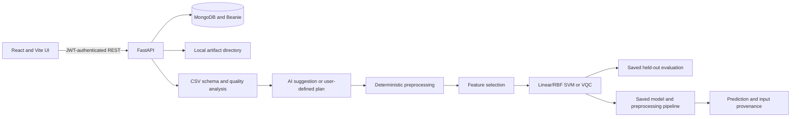

# Hybrid QML Disease Detection Platform
A hybrid quantum-classical machine learning platform for early disease detection from medical datasets. The system uses AI-driven data preprocessing, classical ML models such as SVM, and Variational Quantum Classifiers (VQC) to analyze medical data and improve disease prediction. It supports quantum simulation, noise-aware evaluation , providing model comparison and interpretable results for healthcare applications.
\\\
## PROTOTYPE LINK:
https://disease-detection-frontend-eqao.onrender.com/
USER MAIL:hqml@gmail.com
PASSWORD:12345678

we had deployed on render's free tier it is limited with 512mb ram, so do not try to do intensive training with more feature and large vqc circuits, it may cause crashing
\\\


# Future Scope
Larger Medical Datasets: Train on larger and more diverse datasets for better generalization.
Medical Image Processing: Integrate CNN-based image analysis for X-rays, CT scans, MRI scans, and other medical images.
Hybrid Quantum ML: Further develop SVM + VQC models and evaluate them on increasingly capable quantum hardware.
Real Quantum Hardware: Expand testing from simulators to real quantum processors.
Multi-Disease Detection: Extend the system to detect and predict multiple diseases.
Explainable AI: Add XAI techniques to make predictions more transparent and interpretable.
Personalized Prediction: Develop patient-specific risk assessment and early-warning systems.
Clinical Integration: Future integration with healthcare systems to support clinicians in decision-making.
This repository contains a web application for uploading tabular datasets, inspecting their schema, preparing them for binary classification, training or evaluating models, and reviewing predictions. The checked-in research example studies the Survey Lung Cancer Dataset. The application is a research prototype; its outputs are not medical diagnoses or clinically validated risk estimates.

## Checked-in Experimental_ML checkpoints and results

The platform discovers runnable checkpoints from `Experimental_ML/Lung_Cancer` and associates them with the source result files. Each row below is the recorded holdout result for **450 test rows**. Percentages are rounded to one decimal; ROC-AUC is shown on its 0–1 scale.

| Saved checkpoint | Accuracy | Balanced acc. | Sensitivity | Specificity | Precision | F1 | ROC-AUC |
|---|---:|---:|---:|---:|---:|---:|---:|
| Logistic regression · 4 features | 51.8% | 51.7% | 58.1% | 45.3% | 52.0% | 54.9% | 0.526 |
| Linear SVM · 4 features | 50.9% | 50.9% | 52.0% | 49.8% | 51.3% | 51.6% | 0.497 |
| RBF SVM · 4 features | 52.4% | 52.5% | 51.1% | 53.8% | 53.0% | 52.0% | 0.532 |
| Linear SVM · 6 features | 50.4% | 50.0% | 100.0% | 0.0% | 50.4% | 67.1% | 0.454 |
| RBF SVM · 6 features | 54.7% | 54.6% | 60.8% | 48.4% | 54.5% | 57.5% | 0.532 |
| Linear SVM · 8 features | 50.4% | 50.0% | 100.0% | 0.0% | 50.4% | 67.1% | 0.506 |
| RBF SVM · 8 features | 50.4% | 50.0% | 100.0% | 0.0% | 50.4% | 67.1% | 0.488 |
| VQC · 4 qubits, noiseless | 52.7% | 52.7% | 49.8% | 55.6% | 53.3% | 51.5% | 0.515 |
| VQC · 4 qubits, noisy | 52.7% | 52.7% | 49.3% | 56.1% | 53.3% | 51.3% | 0.517 |
| VQC · 6 qubits | 53.1% | 52.9% | 74.5% | 31.4% | 52.5% | 61.6% | 0.556 |
| VQC · 8 qubits | 48.4% | 48.5% | 42.7% | 54.3% | 48.7% | 45.5% | 0.499 |

Source: [`model_comparison_metrics.json`](Experimental_ML/Lung_Cancer/results/classical_vs_quantum/model_comparison_metrics.json), plus the per-feature SVM metrics files for 6- and 8-feature linear SVM results. The selected feature orders are in `Experimental_ML/Lung_Cancer/data/processed/selected_features*.json`.

These scores are modest and several models behave poorly (for example, the 6- and 8-feature linear SVM checkpoints predict the positive class for every test row). They should be treated as experimental results, not evidence of diagnostic performance. Some additional models have metric rows but no saved estimator file; the app only registers checkpoints it can actually load.


## What I can do in the web app

1. **Create an account and upload a CSV.** Each uploaded file is stored as a dataset version associated with the signed-in user.
2. **Inspect that version.** The app reads the uploaded file and reports its row and column counts, names, data types, missing values, column summaries/distributions, duplicate rows, and possible target information.
3. **Prepare the data.** I can request an AI-assisted plan or choose preprocessing steps myself. Supported operations include train/validation/test splitting, numeric and categorical imputation, encoding, scaling, and IQR outlier removal.
4. **Choose a target and features.** Feature ranking supports mutual information, Random Forest importance, ANOVA F-test, L1 logistic/LASSO, and manual selection.
5. **Train or evaluate a model.** The standard templates are linear SVM, RBF SVM, and PennyLane VQC. Saved checkpoints from `Experimental_ML/Lung_Cancer` are also listed when their files are available.
6. **Review results.** A completed run records accuracy, balanced accuracy, sensitivity, specificity, precision, F1, ROC-AUC (when defined), test-set size, confusion matrix, and train-versus-test generalization metrics.
7. **Run predictions with a saved trained model.** The prediction form uses the model’s saved feature list and preprocessing transformer. I can adjust the decision threshold and inspect the values, score, threshold, and run provenance used for a prediction.

## Repository map

```text
hybrid-qml-disease-detection/
├── README.md
├── Diseases_Detection_Paltform/          # Main web application (directory spelling is intentional)
│   ├── docker-compose.yml                 # Canonical full-stack Compose file
│   ├── backend/
│   │   ├── app/api/v1/                    # FastAPI endpoints
│   │   ├── app/agents/preprocessing_agent/ # Schema-aware plan and execution logic
│   │   ├── app/ml/                        # SVM/VQC code and Experimental_ML checkpoint loader
│   │   ├── app/services/                  # Dataset, model, training, artifact services
│   │   ├── app/database/models/           # MongoDB/Beanie documents
│   │   ├── models/pretrained/             # Fallback checkpoint files and metadata
│   │   ├── tests/                         # Backend pytest suite
│   │   ├── artifacts/                     # Local runtime artifact storage
│   │   └── requirements.txt
│   └── frontend/
│       ├── src/pages/                     # Dataset, preprocessing, models, training, prediction, reports
│       ├── src/api/                       # Axios client and API methods
│       └── package.json
├── Experimental_ML/Lung_Cancer/           # Notebooks, data, metrics, and saved research checkpoints
└── ai_preprocessing_agent/                # Standalone preprocessing-agent package and examples
```

`ai_preprocessing_agent/` is a separate research package with its own requirements and tests. The web app runs the integration under `Diseases_Detection_Paltform/backend/app/agents/preprocessing_agent/`.

## How the application is wired



The frontend is React 18, TypeScript, Vite, React Router, TanStack Query, and Tailwind CSS. The backend is FastAPI with MongoDB/Beanie, pandas, scikit-learn, joblib, and PennyLane. Dataset uploads, trained estimators, preprocessing artifacts, and run files are written under `ARTIFACT_ROOT` by `LocalArtifactStorage`; the current service code uses local files rather than MinIO for these artifacts.

## Run the full application with Docker Compose

Docker Desktop with Compose is the recommended start. Run the canonical Compose file from its directory:

```powershell
cd Diseases_Detection_Paltform
docker compose up --build -d
docker compose ps
docker compose logs -f backend
```

Open:

| Service | Address |
|---|---|
| Web app | [http://localhost:3000](http://localhost:3000) |
| FastAPI Swagger docs | [http://localhost:8000/api/v1/docs](http://localhost:8000/api/v1/docs) |
| API health | [http://localhost:8000/api/v1/health](http://localhost:8000/api/v1/health) |
| MongoDB | `localhost:27017` |
| Redis | `localhost:6379` |
| MinIO console | [http://localhost:9001](http://localhost:9001) |
| Ollama container | `localhost:11434` |

The Compose stack starts MongoDB, Redis, MinIO, Ollama, the API, a Celery worker, and the frontend. MongoDB is the active application database. The API currently stores artifacts on the mounted `backend_artifacts` volume. The Compose file also mounts `../Experimental_ML` read-only into the backend and worker so the catalog can load the source checkpoint files and metrics.

The development Compose file includes development secrets and default MinIO credentials. Replace them before using a shared or internet-accessible deployment. `docker compose down` stops the stack while keeping named volumes. Removing volumes also deletes the stored database and artifact data.

## Run the backend and frontend separately

These instructions are for Windows PowerShell. Python 3.11 is used by the backend Dockerfile; Node.js 20 is used by the frontend Docker build.

### 1. Start MongoDB

From `Diseases_Detection_Paltform/`, start the database service:

```powershell
docker compose up -d mongodb
```

The backend can run without Redis or MinIO for the synchronous upload/training path. The optional worker and external LLM setup require their respective services.

### 2. Install and start the backend

```powershell
cd backend
py -3.11 -m venv .venv
.\.venv\Scripts\Activate.ps1
python -m pip install -r requirements.txt
Copy-Item .env.example .env
```

Review `.env`, especially `JWT_SECRET`, `MONGODB_URL`, and `ARTIFACT_ROOT`, then start the API:

```powershell
uvicorn app.main:app --reload --host 0.0.0.0 --port 8000
```

Run this from `Diseases_Detection_Paltform/backend`. The checkpoint loader searches upward for the project’s `Experimental_ML/Lung_Cancer` folder. If the artifacts are mounted elsewhere, set `EXPERIMENT_ROOT` to the full path of the `Lung_Cancer` directory.

### 3. Install and start the frontend

In another terminal:

```powershell
cd Diseases_Detection_Paltform/frontend
npm install
Copy-Item .env.example .env
npm run dev
```

The Vite server is configured for port `3000`. The example API URL points to `http://localhost:8000/api/v1`; the backend’s default CORS origins include the local frontend ports.

### First use

Open the web app, register an account, then follow **Datasets → Preprocessing → Features → Training → Results**. Select the same dataset version, target, and feature columns throughout the pipeline. A trained model appears under **Models** and can then be selected in **Predictions**.

## Dataset and training requirements

- Upload a tabular CSV (supports files up to 100MB with a robust 5-minute processing window). The optional built-in lung-cancer demo is a small **20-row demo file**, not the 2,998-row research dataset or a clinical benchmark.
- Preprocessing needs at least 6 rows to create train, validation, and test partitions. Training templates require a target with exactly two non-missing classes.
- Numeric/categorical columns are discovered from the uploaded file. The preprocessing plan and feature-selection UI use that version’s actual columns.
- The standard split is 70% training, 15% validation, and 15% held-out test. Transformations are fitted on training rows and then applied to validation/test rows.
- VQC safely supports up to **24 encoded feature dimensions** (accommodating one-hot encoded categorical variables) and up to **10 strongly entangling layers** by the training service. The interactive **CircuitDesigner** allows users to visualize the quantum circuit architecture dynamically before initiating the simulator.
- Imported lung-cancer checkpoints have stricter requirements: target `LUNG_CANCER`, the checkpoint’s exact feature names and order, numeric columns, and min-max scaling on that full feature set. A checkpoint is evaluated on the uploaded data; the checkpoint is **not fine-tuned** by that operation. Other built-in SVM/VQC templates are fitted on the uploaded data.
- A new run saves a model artifact, a training record, an evaluation record, and an experiment record. Its held-out metrics are available in the run results, model details, and performance report.


## What the main screens show

| Screen | What it is for |
|---|---|
| Datasets | Upload CSV versions and inspect shape, columns, types, missing values, summaries, distributions, and duplicate-row count. |
| Preprocessing | Select AI-assisted or user-defined transformations; review the plan before execution. |
| Features | Select a target, rank features, or choose columns manually. |
| Models | View source checkpoints, trainable templates, and models trained on uploads with their recorded metrics. |
| Training | Train a template or evaluate a compatible saved checkpoint against the selected upload. |
| Evaluation | Review metrics and compare saved training runs. Comparison requires compatible dataset/target/feature contexts. |
| Predictions | Enter values for the saved model’s selected features, set a threshold, and run inference. |
| Explainability | Review the submitted values, model output, threshold, and pipeline provenance. The current screen does not calculate per-feature attribution values. |
| Experiments / Reports | Review the saved experiment chain and a report built from recorded model metrics. |

## API map

All application routes are under `/api/v1`. OpenAPI/Swagger is at `/api/v1/docs` and ReDoc is at `/api/v1/redoc`.

| Area | Main routes |
|---|---|
| Health/version | `GET /health`, `GET /version` |
| Authentication | `POST /auth/register`, `POST /auth/login`, `POST /auth/refresh`, `GET /auth/me` |
| Datasets | `GET/POST /datasets`, `POST /datasets/{id}/versions`, `GET /datasets/{id}/versions/{version_id}/analysis` |
| Preprocessing | `POST /preprocessing/plan`, `POST /preprocessing/execute`, `POST /preprocessing/ai/modify` |
| Features | `POST /features/select` |
| Models | `GET /models`, `GET /models/defaults`, `GET /models/{id}`, `POST /models/compare` |
| Training | `GET/POST /training`, `GET /training/{run_id}` |
| Prediction | `POST /predictions` |
| Evaluation | `GET /evaluation/{training_run_id}`, `POST /evaluation/compare` |
| Quantum | `GET /quantum/devices`, `POST /quantum/jobs` |
| Experiments/artifacts | `/experiments`, `/experiments/{id}`, `/artifacts/reports/{experiment_id}` |

All data and model routes require a bearer token obtained through login. Dataset versions and training records are scoped to the authenticated user; shared default models are available to signed-in users.

## Configuration

The backend reads environment variables (and `.env` in its working directory). The corrected starter file is [`backend/.env.example`](Diseases_Detection_Paltform/backend/.env.example).

| Variable | Purpose |
|---|---|
| `MONGODB_URL`, `MONGODB_DB` | MongoDB connection and database name; Beanie initializes document models at API startup. |
| `JWT_SECRET`, `JWT_ALGORITHM`, token expiry variables | JWT signing and access/refresh lifetimes. Set a private random secret before deployment. |
| `ARTIFACT_ROOT` | Local directory for uploaded CSVs, model bundles, preprocessing outputs, and related artifacts. |
| `CORS_ORIGINS` | Comma-separated browser origins allowed by FastAPI. |
| `EXPERIMENT_ROOT` | Optional full path to `Experimental_ML/Lung_Cancer`; normally discovered from the source checkout. |
| `REDIS_URL` | Celery broker/backend used by the included worker infrastructure. The current training HTTP route executes training synchronously. |
| `LLM_BASE_URL` | URL for the current Gemma-compatible `/generate` client. If it is unreachable or incompatible, the agent returns fallback recommendation text. |

The active backend database is MongoDB/Beanie. `backend/docker-compose.yml` and some older component documentation describe a PostgreSQL/Gemma stack; use `Diseases_Detection_Paltform/docker-compose.yml` as the canonical application Compose file.

## Tests and build commands

The backend has pytest tests under `Diseases_Detection_Paltform/backend/tests/`:

```powershell
cd Diseases_Detection_Paltform/backend
python -m pytest tests/ -v
```

The standalone package has its own tests and requirements:

```powershell
cd ai_preprocessing_agent
python -m pip install -r requirements.txt
python -m pytest tests/ -v
```

Build the frontend production bundle with:

```powershell
cd Diseases_Detection_Paltform/frontend
npm install
npm run build
```

## Important limitations

- This is a research/prototype app for tabular classification; it is not a medical device and must not be used to diagnose or guide treatment.
- The checked-in case study is survey data with 2,998 observations, not a hospital cohort. The saved 450-row holdout results are near chance for many models.
- The platform’s risk levels and model scores are prototype outputs, not calibrated or clinically validated risk estimates.
- The explainability page reports actual model inputs and provenance but does not currently produce SHAP/LIME/per-feature attribution.
- The preprocessing LLM client sends the prompt and summary context to the configured endpoint. That context includes schema/statistical details and sample values; use a trusted endpoint and avoid uploading identifiable data. The deterministic preprocessing code, not the LLM prose, executes transformations.
- The current `LLMFactory` returns the Gemma-compatible client. The full Compose file points `LLM_BASE_URL` at Ollama, whose API is not the client’s `/generate` endpoint; in that configuration, recommendation text falls back to the built-in heuristic. The schema-aware preprocessing plan and execution can still run.
- The quantum code uses PennyLane simulators. The repository does not configure a real QPU connection for model training or patient predictions.
- Redis/Celery and MinIO services are present in Compose, but current dataset/model artifact persistence uses local filesystem storage, and the `/training` API handler currently performs work synchronously.

## Troubleshooting

- **Large Dataset Upload Failures (Timeout or `413 Request Entity Too Large`)**:
  The application Nginx proxy has been configured to accept bodies up to 100MB, and the frontend Axios client timeout is set to 5 minutes (300,000ms). If uploads fail or time out, ensure your Docker Engine has adequate resources allocated and verify that your local network/VPN proxy settings are not interrupting large multipart uploads to `localhost`.
- **Docker Compose Build Failures (`no such host`)**:
  If a step fails with a DNS resolution error fetching from Docker Hub (e.g., `registry-1.docker.io`), this is a transient Docker networking issue. Retry the build step or restart your Docker Desktop daemon.
