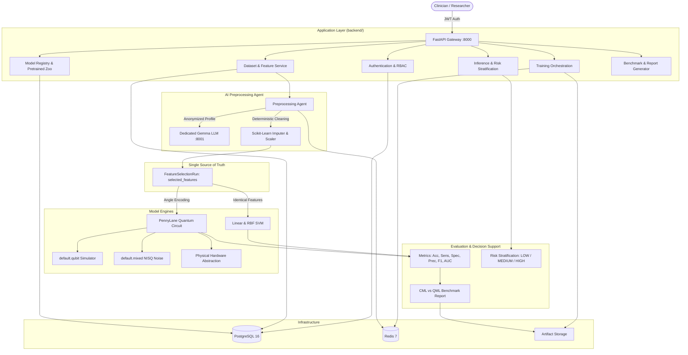

# Hybrid Quantum Machine Learning Platform for Early Disease Detection

[](https://www.python.org/downloads/)
[](https://fastapi.tiangolo.com)
[](https://pennylane.ai/)
[](https://www.docker.com/)
[](https://opensource.org/licenses/MIT)

An enterprise-ready, end-to-end platform for early disease screening and risk stratification:
> **"Hybrid Quantum Machine Learning Platform for Early Disease Detection"**

The platform integrates AI-assisted biomedical data preprocessing, canonical feature selection, classical Support Vector Machines (SVM), and Variational Quantum Classifiers (VQC) simulated with PennyLane on noiseless and noisy NISQ backends.

---

## 1. System Architecture



---

## 2. Repository Structure

```
hybrid-qml-disease-detection/
├── Diseases_Detection_Paltform/               # Development & Deployment Platform
│   ├── frontend/                              # Production React 18 / TypeScript Web Application (:3000)
│   │   ├── src/                               # 28+ Clinical routes, typed API client, components
│   │   ├── Dockerfile                         # Multi-stage production container (Node 20 -> Nginx Alpine)
│   │   ├── nginx.conf                         # SPA routing fallback & backend API proxy
│   │   └── README.md                          # Full frontend architecture, workflows, & Docker guide
│   │
│   └── backend/                               # Production FastAPI Application Gateway Layer (:8000)
│       ├── app/                               # FastAPI Core, API v1, Models, Services, Repositories
│       │   ├── api/v1/                        # Auth, Datasets, Preprocessing, Features, Models, Training, Predictions, Quantum
│       │   ├── ml/                            # Classical SVMs, PennyLane VQC, Pretrained Loader
│       │   ├── agents/preprocessing_agent/    # Gemma-assisted AI data cleaning & leakage prevention (from ai_preprocessing_agent)
│       │   ├── quantum/                       # PennyLane Simulator, Noisy NISQ, and Hardware Registry
│       │   └── workers/                       # Celery asynchronous task queues
│       ├── gemma/                             # Dedicated Dockerized Gemma LLM Inference Microservice (:8001)
│       ├── models/pretrained/                 # Default pre-trained models accessible to all users
│       ├── migrations/                        # Alembic async database migrations (19 tables)
│       ├── tests/                             # Unit, API, RBAC, Model Comparison, and End-to-End integration tests
│       ├── Dockerfile                         # Backend production container
│       ├── docker-compose.yml                 # Backend service stack specification
│       └── README.md                          # Detailed backend documentation
├── docker-compose.yml                         # Root multi-service stack (frontend, backend, gemma, postgres, redis, worker)
│
├── Experimental_ML/                           # Research, Benchmarks, and Notebooks (Untouched)
│   └── Lung_Cancer/
│       ├── CML/                               # Classical ML training (4, 6, 8 features)
│       ├── HQML/                              # PennyLane VQC noiseless & noisy experiments
│       └── data/                              # Benchmark cohort datasets
│
├── ai_preprocessing_agent/                    # Standalone Preprocessing Research Agent (Untouched)
│
└── Experiment_Training_With_Cancer_Data_Set/  # Historical training prototypes (Untouched)
```

---

## 3. Pre-trained Models Available to All Users by Default

The platform includes production-ready models trained and validated against lung cancer clinical cohorts, located in [`Diseases_Detection_Paltform/backend/models/pretrained/`](file:///Diseases_Detection_Paltform/backend/models/pretrained/) and configured as **system-wide default models**:

| Model Name | Framework | Architecture / Circuit | Features Used |
| :--- | :--- | :--- | :--- |
| **Classical Linear SVM** | Scikit-Learn | Linear kernel, $C=1.0$, probability calibration | `WHEEZING`, `YELLOW_FINGERS`, `AGE`, `SHORTNESS_OF_BREATH` |
| **Classical RBF SVM** | Scikit-Learn | Radial Basis Function, $C=1.0$, $\gamma=\text{scale}$ | `WHEEZING`, `YELLOW_FINGERS`, `AGE`, `SHORTNESS_OF_BREATH` |
| **4-Qubit VQC (Noiseless)** | PennyLane | AngleEmbedding ($RY(x_i \cdot \pi)$), 2 entangling layers, Pauli-Z expectation | `WHEEZING`, `YELLOW_FINGERS`, `AGE`, `SHORTNESS_OF_BREATH` |
| **4-Qubit VQC (Noisy NISQ)** | PennyLane | `default.mixed` open quantum system with depolarizing noise and readout error | `WHEEZING`, `YELLOW_FINGERS`, `AGE`, `SHORTNESS_OF_BREATH` |
| **6-Qubit VQC** | PennyLane | 6 qubits, 2 variational layers with linear CNOT entanglement | Top 6 ranked biomarkers |
| **8-Qubit VQC** | PennyLane | 8 qubits, 2 variational layers with linear CNOT entanglement | Top 8 ranked biomarkers |

Every registered user can query, evaluate, and run inference using these models directly via:
```http
GET /api/v1/models/defaults
```

### Multi-Model Comparison
Users can select 2 or more models to view an exhaustive, side-by-side evaluation comparison across all clinical metrics:
```http
POST /api/v1/models/compare
```
Payload:
```json
{
  "model_ids": [
    "pretrained-cml-svm-linear-4",
    "pretrained-cml-svm-rbf-4",
    "pretrained-qml-vqc-4-noiseless"
  ]
}
```
Returns:
- Complete metrics matrix (Accuracy, Balanced Accuracy, Sensitivity, Specificity, Precision, F1-Score, ROC-AUC, Training Time)
- Confusion Matrix comparison (TP, TN, FP, FN)
- Category winners (e.g. Best Accuracy, Best Sensitivity for screening)
- CML vs QML comparative insights and formatted Markdown comparison table.

---

## 4. Key Architectural Guarantees

1. **Single Source of Truth for Features:**
   Feature count is never configured independently inside models. Canonical feature ranking (`POST /api/v1/features/select`) generates a `FeatureSelectionRun` that feeds both Classical SVM and Quantum VQC identically to guarantee scientific comparability.
2. **Integrated AI Preprocessing Agent:**
   The full LangGraph preprocessing agent from `ai_preprocessing_agent` is integrated directly into the backend under `app/agents/preprocessing_agent/`. It coordinates with the Gemma microservice for clinical reasoning while executing deterministic Scikit-Learn tools.
3. **Data Leakage Prevention:**
   Learned transformations (imputers, scalers, encoders) are fit strictly on training splits. Validation and test sets are transformed without refitting.
4. **Dedicated Gemma LLM Service:**
   Gemma runs in an isolated container (`Diseases_Detection_Paltform/backend/gemma/`) reachable only through the internal Docker network. It handles clinical reasoning over statistical metadata, but **never executes arbitrary Python code** and never receives raw patient records.
5. **Multi-Tenant User Isolation:**
   Datasets, model versions, and training runs check ownership (`user_id`). Access to another user's private resources returns `403 Forbidden` (`PERMISSION_DENIED`). Default pre-trained models remain accessible to all users.
6. **Noiseless, Noisy, and Hardware Compatibility:**
   Unified quantum backend abstraction supporting statevector simulation (`default.qubit`), open quantum system noise (`default.mixed`), and real physical QPUs.

---

## 5. Dockerized Deployment

Start the complete 6-service application stack:

```bash
docker-compose up --build -d
```

### Services Started:
- **Clinical Frontend Application:** `http://localhost:3000`
- **FastAPI Backend Gateway:** `http://localhost:8000`
- **Interactive Swagger Documentation:** `http://localhost:8000/api/v1/docs`
- **Gemma LLM Inference Microservice:** `http://localhost:8001`
- **PostgreSQL 16 Database:** `localhost:5432`
- **Redis 7 Broker & Cache:** `localhost:6379`
- **Celery Worker:** Asynchronous background training & QPU execution

### Run Database Migrations:
```bash
docker-compose exec backend alembic upgrade head
```

### Run Test Suite:
```bash
docker-compose exec backend pytest tests/ -v
```

---

## 6. Clinical Decision Support & Medical Safety Notice

> **IMPORTANT MEDICAL NOTICE:**
> The Hybrid Quantum Machine Learning Platform for Early Disease Detection is a research and computational screening tool. Predictions, estimated probabilities, and risk stratifications (`LOW`, `MEDIUM`, `HIGH`) are statistical model outputs and do **NOT** constitute medical diagnoses or clinical guarantees. All findings must be evaluated by licensed medical practitioners alongside conventional diagnostic modalities.
