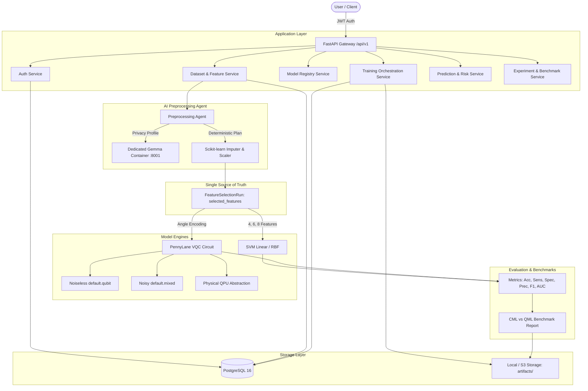

# Hybrid Quantum Machine Learning Platform for Early Disease Detection — Backend

A production-grade, enterprise-ready backend platform designed for hybrid classical-quantum biomedical learning, automated AI data preprocessing, and early disease risk stratification.

---

## 1. Project Purpose & SIH Problem Statement Alignment

This platform addresses the Smart India Hackathon (SIH) challenge:
> **"Hybrid Quantum Machine Learning Platform for Early Disease Detection"**

The objective is to provide a complete pipeline from raw biomedical data ingestion to hybrid quantum classification, delivering:
1. **Biomedical Data Ingestion & Preprocessing:** Data cleaning, missing value imputation, categorical encoding, and feature scaling.
2. **AI Preprocessing Agent:** Gemma-powered clinical reasoning proposing deterministic transformation plans with human approval and strict data leakage prevention.
3. **Canonical Feature Selection (Single Source of Truth):** Feature ranking and selection via mutual information, ANOVA, or tree-based importance that feeds both classical ML and quantum models identically.
4. **Classical Machine Learning Baselines:** Linear and Radial Basis Function (RBF) Support Vector Classifiers (SVM).
5. **Hybrid Quantum Machine Learning:** Variational Quantum Classifiers (VQC) with angle encoding and entangling variational ansatzes simulated via PennyLane.
6. **Hardware & Noise Simulation:** Support for noiseless statevector simulation (`default.qubit`), open quantum system noisy simulation (`default.mixed`), and real physical QPU abstractions.
7. **Clinical Decision Support & Risk Stratification:** Risk levels (`LOW`, `MEDIUM`, `HIGH`) calibrated with configurable decision thresholds and diagnostic safety disclaimers.
8. **Reproducibility & Provenance:** Every trained model is linked to its exact dataset version, preprocessing pipeline, feature selection run, and training configuration.

---

## 2. End-to-End System Architecture



---

## 3. Technology Stack

- **Framework:** Python 3.11+, FastAPI, Uvicorn, Pydantic v2
- **Database & Migrations:** PostgreSQL 16, SQLAlchemy 2.0 (AsyncIO), Alembic
- **Security:** Argon2id (`argon2-cffi`), PyJWT (`pyjwt`)
- **Scientific Computing:** NumPy, Pandas, SciPy, scikit-learn, joblib
- **Quantum Computing:** PennyLane 0.36+
- **AI Agent & LLM:** LangGraph, LangChain, Dedicated Containerized Gemma Microservice
- **Background Tasks & Caching:** Redis 7, Celery 5.4+
- **Infrastructure:** Docker, Docker Compose

---

## 4. Existing Repository Integration Notes

The existing repository contained experimental research notebooks and training scripts in `Experimental_ML/` and `ai_preprocessing_agent/`. These research assets remain completely intact and outside the `backend/` folder:

| Existing Asset | Path | Integration & Reusability in Backend |
| :--- | :--- | :--- |
| **Noiseless VQC Training** | `Experimental_ML/Lung_Cancer/HQML/4-feature-VQC/code/train_vqc.py` | Wrapped inside `backend/app/ml/quantum/vqc/circuit.py` and `model.py`. Uses identical angle encoding ($RY(x_i \cdot \pi)$), 2 variational layers with linear CNOT entanglement, and Pauli-Z expectation pooling. |
| **Noisy NISQ VQC Training** | `Experimental_ML/Lung_Cancer/HQML/4-feature-VQC-Noisy/code/train_vqc_noisy.py` | Implemented in `backend/app/ml/quantum/vqc/noisy.py` with `default.mixed`, `DepolarizingChannel`, and `BitFlip`. |
| **Classical ML Benchmarks** | `Experimental_ML/Lung_Cancer/CML/4-feature/code/train_classical.py` | Wrapped inside `backend/app/ml/classical/svm/linear.py` and `rbf.py`. Evaluates identical metrics ($TP, TN, FP, FN$, Sensitivity, Specificity, ROC-AUC). |
| **Processed Datasets** | `Experimental_ML/Lung_Cancer/data/processed/` | Provides benchmark baseline datasets (`X_train_4.csv`, `selected_features.json`). |
| **AI Preprocessing Agent** | `ai_preprocessing_agent/` | Core architecture adapted into `backend/app/agents/preprocessing_agent/interface.py`. |

---

## 5. Storage Architecture

```
backend/
├── artifacts/
│   ├── datasets/<dataset_id>/versions/<version_id>/original.csv
│   ├── preprocessing/<run_id>/fitted_pipeline.joblib
│   ├── models/<model_id>/versions/<version_id>/model.joblib
│   ├── evaluations/<evaluation_id>/metrics.json
│   ├── experiments/<experiment_id>/benchmark_report.md
│   └── reports/
```

- **Original Datasets:** Stored immutably. Never overwritten.
- **Fitted Pipelines:** Serialized joblib binaries containing imputer and scaler parameters fitted strictly on training data.
- **Trained Model Artifacts:** Serialized models, feature boundaries, and canonical feature names.

---

## 6. Single Source of Truth for Feature Selection

In this platform, **feature count is NOT an independent model parameter**.
1. Feature ranking is performed across normalized data via Mutual Information, ANOVA F-test, or Random Forest importance.
2. A `FeatureSelectionRun` record is created containing the canonical list:
   ```json
   ["WHEEZING", "YELLOW_FINGERS", "AGE", "SHORTNESS_OF_BREATH"]
   ```
3. **Both SVM and VQC consume this exact feature set**. This guarantees fair, reproducible CML vs QML benchmarking.

---

## 7. Gemma LLM Microservice

The platform includes a dedicated, containerized Gemma service running in `backend/gemma/` (`http://gemma:8001`):
- **Network Isolation:** Runs on the internal Docker network. The frontend cannot access Gemma directly.
- **No Arbitrary Code Execution:** Gemma reasons over statistical metadata (missingness, skewness, row count) to propose plans, but NEVER executes arbitrary code.
- **Data Privacy:** Raw patient records are never transmitted to Gemma.

---

## 8. Docker Deployment

To launch the complete platform (Backend, Gemma, PostgreSQL, Redis, Celery Worker):

```bash
cd backend
docker-compose up --build -d
```

### Checking Services Status:
```bash
docker-compose ps
```

### Access Points:
- **FastAPI Documentation (Swagger UI):** `http://localhost:8000/api/v1/docs`
- **ReDoc:** `http://localhost:8000/api/v1/redoc`
- **Health Endpoint:** `http://localhost:8000/api/v1/health`
- **Gemma Health Endpoint:** `http://localhost:8001/health`
- **PostgreSQL:** `localhost:5432`
- **Redis:** `localhost:6379`

---

## 9. Running Migrations

Database schema migrations are managed via Alembic:

```bash
cd backend
alembic upgrade head
```

---

## 10. Running Automated Tests

Run the test suite using pytest:

```bash
cd backend
pytest tests/ -v
```

---

## 11. Clinical Safety Disclaimer

> **IMPORTANT MEDICAL NOTICE:**
> The Hybrid Quantum Machine Learning Platform for Early Disease Detection is a research and computational screening tool. Predictions, estimated probabilities, and risk stratifications (`LOW`, `MEDIUM`, `HIGH`) are statistical model outputs and do **NOT** constitute medical diagnoses or clinical guarantees. All findings must be evaluated by licensed medical practitioners alongside conventional diagnostic modalities.
